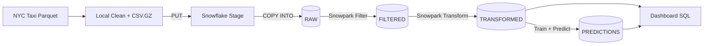

# 🚕 NYC Taxi Demand Forecasting on Snowflake (Snowpark + LightGBM)

End-to-end data + ML pipeline that ingests NYC Yellow Taxi data into **Snowflake**, cleans and transforms it at scale using **Snowpark**, trains a **LightGBM** time-series model (Optuna tuned), and writes predictions back to Snowflake for dashboarding.

> Data is not included in this repo (large). Place parquet files locally under `data/raw/` before running.

---

## What this project does (end-to-end)

1) **Ingest (RAW)**  
Parquet → cleaned `.csv.gz` → Snowflake **stage** (`PUT`) → `COPY INTO` RAW table  
**Table:** `NYC_DATA.PUBLIC.YELLOW_TAXI_DATA_RAW`

2) **Filter (FILTERED)**  
Snowpark cleansing + outlier removal using `APPROX_PERCENTILE(0.999)` per month  
**Table:** `NYC_DATA.PUBLIC.YELLOW_TAXI_DATA_FILTERED`

3) **Transform (TRANSFORMED)**  
Hourly demand grid per zone (complete hours × locations; missing filled with 0)  
**Table:** `NYC_DATA.PUBLIC.YELLOW_TAXI_DATA_TRANSFORMED`  
**Grain:** `(pickup_hour, pickup_location_id)`

4) **Train + Predict (PREDICTIONS)**  
Feature engineering (lags, same-hour rolling windows), LightGBM tuned with Optuna, T+1 demand predictions written back to Snowflake  
**Table:** `NYC_DATA.PUBLIC.YELLOW_TAXI_DATA_PREDICTIONS`

5) **Dashboard SQL (Actual vs Predicted)**  
**SQL:** `sqls/dashboard.sql`

---

## Architecture

### Repo Layout

Project source lives in: sp25_taxi_snowflake/

Key paths:

1. `sp25_taxi_snowflake/notebooks/01_upload_data.ipynb` (ingest → RAW)

2. `sp25_taxi_snowflake/src/filter_data.py` (RAW → FILTERED)

3. `sp25_taxi_snowflake/src/transform_data.py` (FILTERED → TRANSFORMED)

4. `sp25_taxi_snowflake/notebooks/02_train_and_predict.ipynb` (train + predict → PREDICTIONS)

5. `sp25_taxi_snowflake/sqls/dashboard.sql` (actual vs predicted)

### Setup
`python -m venv .venv
source .venv/bin/activate
pip install -r sp25_taxi_snowflake/requirements.txt`

Create .env (do not commit) using .env.example.

### Run Order

1. Ingest to RAW
Open and run: `notebooks/01_upload_data.ipynb`

2. Filter

`python sp25_taxi_snowflake/src/filter_data.py`

3. Transform

`python sp25_taxi_snowflake/src/transform_data.py`

4. Train + Predict
Open and run: `notebooks/02_train_and_predict.ipynb`

5. Dashboard
Run: `sp25_taxi_snowflake/sqls/dashboard.sql`

### Production Hardening (next steps)

1. Parameterize: month range, location IDs, training window
2. Add orchestration: Airflow/Prefect
3. Add monitoring: volume checks, null ratios, drift/performance
4. Add CI: lint + unit tests + notebook validation

### Author
Sharmila Devi
